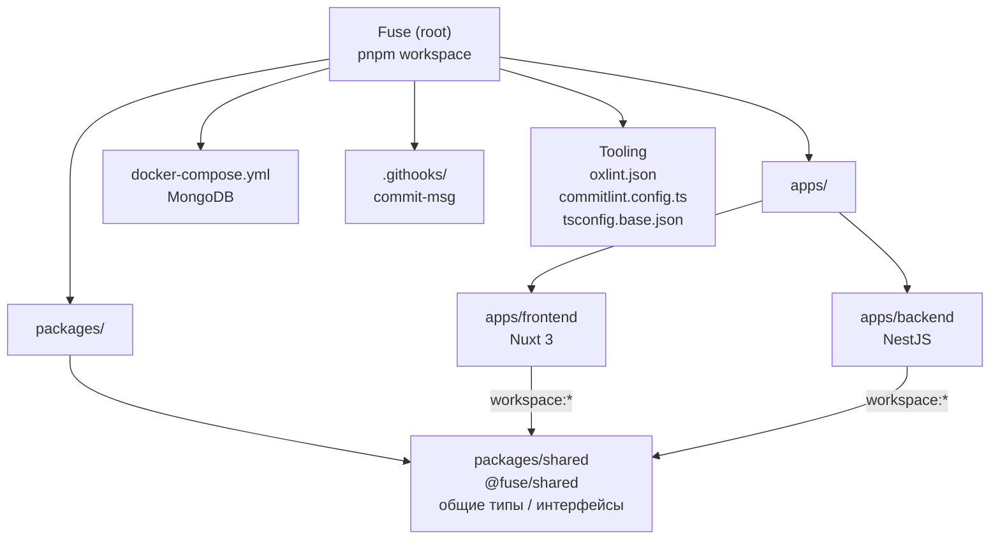
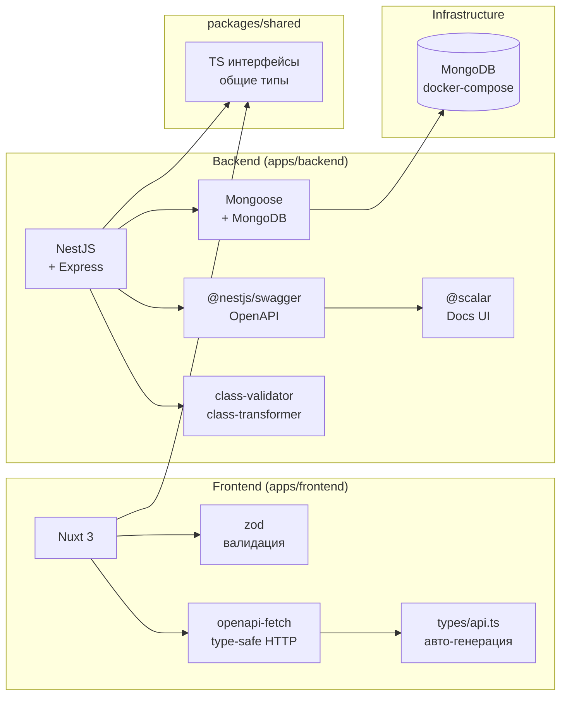
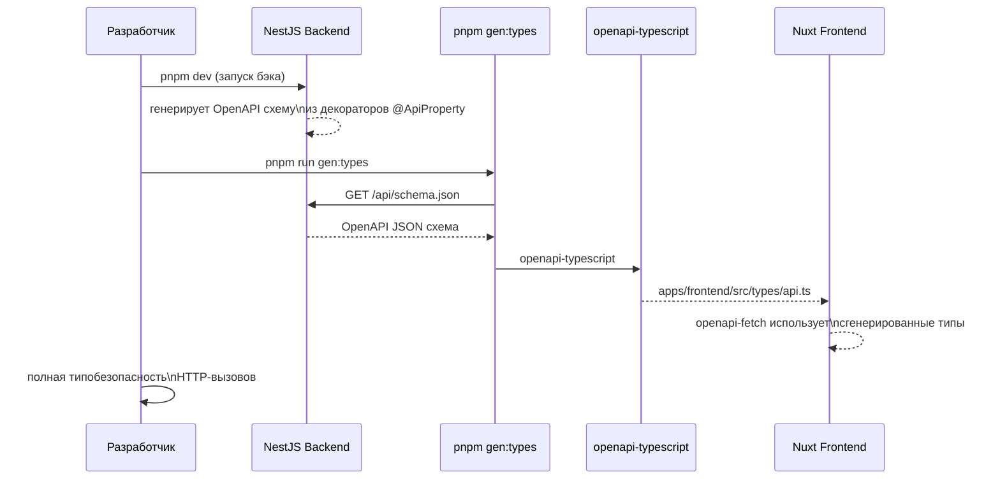
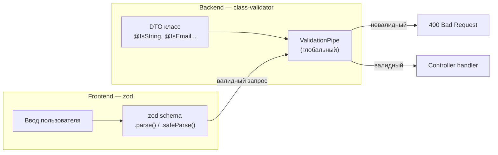
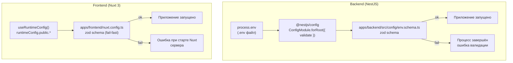
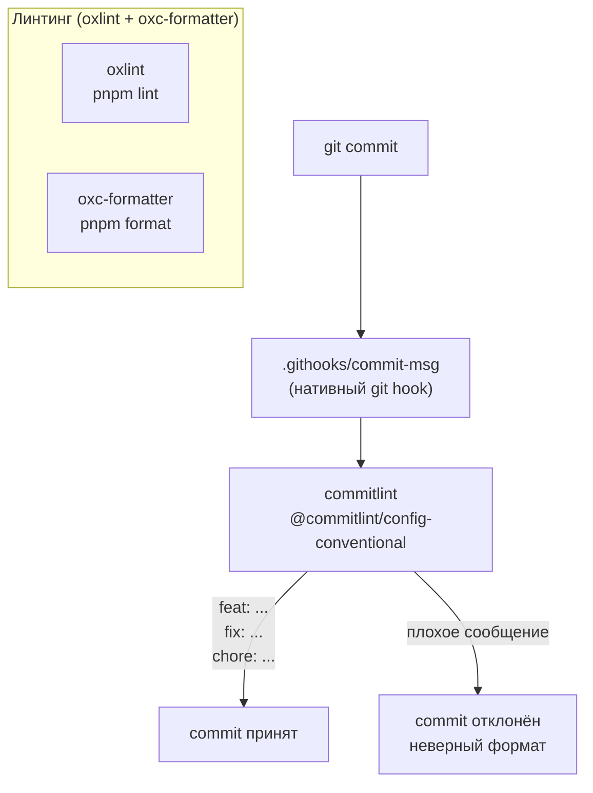
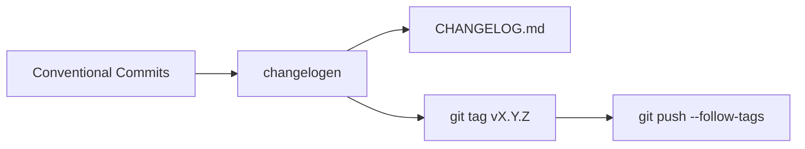
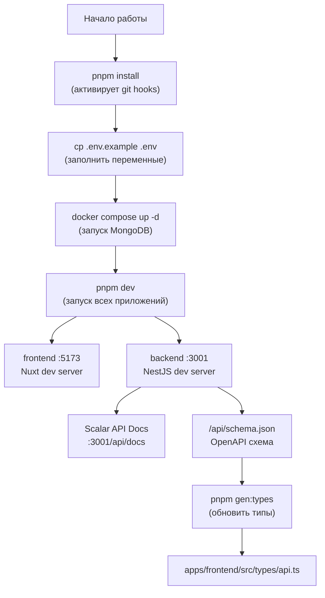

# Структура проекта Fuse

## Монорепозиторий

Проект построен на **pnpm workspaces** и состоит из двух приложений и одного общего пакета.



## Файловая структура

```
Fuse/
├── .githooks/
│   └── commit-msg              # нативный git hook → commitlint
├── apps/
│   ├── frontend/               # Nuxt 3
│   │   ├── pages/
│   │   ├── plugins/
│   │   │   └── api.ts          # openapi-fetch клиент
│   │   ├── src/
│   │   │   └── types/
│   │   │       └── api.ts      # авто-генерация (не редактировать)
│   │   ├── nuxt.config.ts
│   │   ├── tsconfig.json
│   │   └── package.json
│   └── backend/                # NestJS
│       ├── src/
│       │   ├── app.module.ts   # MongooseModule
│       │   ├── main.ts         # Swagger + Scalar
│       │   └── ...
│       ├── tsconfig.json
│       └── package.json
├── packages/
│   └── shared/                 # @fuse/shared
│       ├── src/
│       │   └── index.ts        # TS типы / интерфейсы
│       ├── tsconfig.json
│       └── package.json
├── docs/
│   └── base/
│       └── structure.md        # этот файл
├── docker-compose.yml          # MongoDB (dev)
├── .env.example
├── package.json                # корневой workspace
├── pnpm-workspace.yaml
├── tsconfig.base.json
├── oxlint.json
├── commitlint.config.ts
├── .gitignore
└── .nvmrc
```

## Стек технологий



## Поток OpenAPI типов

Схема автоматической синхронизации типов между бэком и фронтом без ручного дублирования.



## Валидация данных



## Валидация переменных окружения (.env)

Единый инструмент — **zod** — и на фронте, и на бэке. Приложение не запустится, если `.env` не соответствует схеме.



### Backend — реализация

```
apps/backend/src/config/
├── env.schema.ts      # zod схема переменных
└── env.config.ts      # typed ConfigService helper
```

**`apps/backend/src/config/env.schema.ts`:**

```typescript
import { z } from "zod";

export const envSchema = z.object({
  NODE_ENV: z
    .enum(["development", "production", "test"])
    .default("development"),
  PORT: z.string().default("3001").transform(Number),
  MONGODB_URL: z.string().min(1),
});

export type Env = z.infer<typeof envSchema>;
```

**`apps/backend/src/app.module.ts`** — передаём `validate` в `ConfigModule`:

```typescript
ConfigModule.forRoot({
  isGlobal: true,
  validate: (config) => {
    const result = envSchema.safeParse(config);
    if (!result.success) throw new Error(result.error.toString());
    return result.data;
  },
});
```

### Frontend — реализация

Nuxt разделяет переменные на **публичные** (`NUXT_PUBLIC_*` → `runtimeConfig.public`) и **серверные** (`NUXT_*` → `runtimeConfig`). Валидация происходит в `nuxt.config.ts` до старта приложения (fail-fast).

```
apps/frontend/config/
└── env.schema.ts      # zod схема
```

**`apps/frontend/config/env.schema.ts`:**

```typescript
import { z } from "zod";

export const publicEnvSchema = z.object({
  apiBaseUrl: z.string().min(1, "NUXT_PUBLIC_API_BASE_URL is required"),
});

export const serverEnvSchema = z.object({
  sessionSecret: z
    .string()
    .min(32, "NUXT_SESSION_SECRET must be at least 32 characters"),
});
```

**`apps/frontend/nuxt.config.ts`** — загружает `../../.env` и валидирует до старта Nuxt:

```typescript
import { config as loadEnv } from "dotenv";
import { publicEnvSchema, serverEnvSchema } from "./config/env.schema";

loadEnv({ path: resolve(rootDir, "../../.env") });

const publicResult = publicEnvSchema.safeParse({
  apiBaseUrl: process.env.NUXT_PUBLIC_API_BASE_URL ?? "",
});
if (!publicResult.success)
  throw new Error(`[env] Public env validation failed: ...`);
```

## Git-workflow и инструменты качества



### Формат коммитов (Conventional Commits)

| Тип         | Назначение                          |
| ----------- | ----------------------------------- |
| `feat:`     | Новая функциональность              |
| `fix:`      | Исправление бага                    |
| `chore:`    | Рутинные задачи, зависимости        |
| `docs:`     | Документация                        |
| `refactor:` | Рефакторинг без изменения поведения |
| `test:`     | Тесты                               |
| `perf:`     | Оптимизация производительности      |
| `ci:`       | CI/CD конфигурация                  |

## Версионирование

Используется **changelogen** — автоматически формирует `CHANGELOG.md` на основе conventional commits.



### Скрипты релиза

```bash
# Патч-версия (0.0.x) — багфиксы
pnpm version:patch

# Минорная версия (0.x.0) — новые фичи
pnpm version:minor

# Мажорная версия (x.0.0) — breaking changes
pnpm version:major
```

## Локальная разработка


